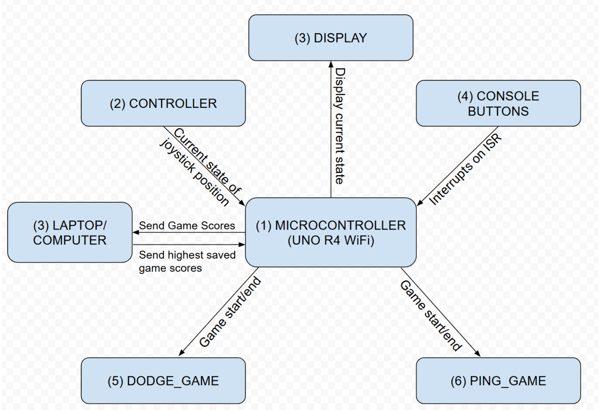
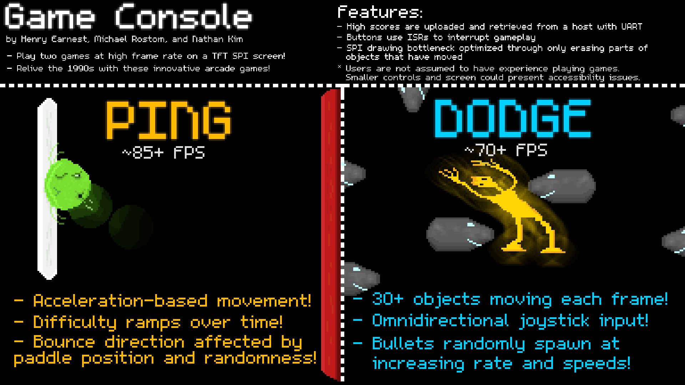

# Retro Game Console & IoT Bridge

**Authors:** Henry Earnest, Michael Rostom, Nathan Kim  
**Course:** CS1600 (Embedded Systems), Fall 2024

*(Above: "Dodge" game mode running at high FPS on Arduino Uno R4)*

## Project Overview
This project is a hybrid embedded system featuring a handheld game console that communicates with a desktop Python backend. We bypassed high-level Arduino libraries to manipulate CPU registers directly, achieving sub-millisecond input latency and fluid 75Hz rendering on constrained hardware.

For a detailed technical breakdown, please read the [Project Report](Docs/Project%20Report.pdf).

### Key Engineering Features
* **Graphics Optimization:** Implemented a "Dirty Rectangle" rendering algorithm to redraw only changed pixels, reducing SPI bus load by ~85% compared to full-frame clearing.
* **System Reliability:** Utilized Watchdog Timers (WDT) and hardware interrupts (ISRs) to prevent freeze states and ensure fault recovery.
* **Full-Stack Integration:** Built a custom UART serial protocol to sync live game state with a Python script (`UART-Laptop.py`), persisting high scores to a local JSON database.
* **Architecture:** Designed a scalable Finite State Machine (FSM) to manage memory and logic transitions between game modes.

---

## System Architecture
The system follows a modular architecture separating the Physics Engine, Display Drivers, and Input Interrupts.

### Key Files
* `GameConsole.cpp`: Main entry point and rendering logic.
* `watchdog_utils.cpp`: Direct register manipulation for WDT and Interrupts.
* `UART-Laptop.py`: Python backend for serial communication and data persistence.

---

## Hardware & Setup

**Materials Needed:**
* 1 Arduino Uno R4 Wifi (Renesas RA4M1)
* 1 ILI9341 TFT LCD display
* 2 Buttons (Home/Reset)
* 1 Joystick

**Wiring Configuration:**

| Component | Pin Function | Arduino Pin |
| :--- | :--- | :--- |
| **Screen** | DC | 8 |
| | RST | 9 |
| | CS | 10 |
| | MOSI | 11 |
| | SCK | 13 |
| **Inputs** | Home Button | 3 |
| | Reset Button | 2 |
| | Joystick X | A0 |
| | Joystick Y | A1 |

## Build Instructions

**1. Flash the Firmware**
* Open `GameConsole.cpp` in Arduino IDE.
* Install the **Arduino_GFX** library (version 1.5.0).
* Upload to the board.

**2. Start the Backend**
* Close the Arduino Serial Monitor (to free the USB port).
* Update `UART-Laptop.py` (Line 52) with your device port (e.g., `COM6` or `/dev/tty...`).
* Run the script: `python UART-Laptop.py`

**3. Operation**
* Wait for the terminal output: "Listening for Arduino..."
* High scores will automatically sync to `scores.json` in the local directory.

## Project Slide (By Henry)

